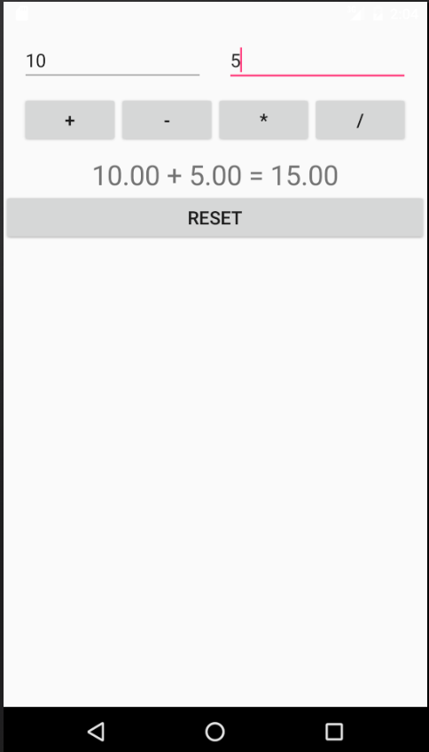

## Android CI Pipeline Demo App


### Pre Requisites
- [Android Studio](https://developer.android.com/studio/index.html) or Android SDK
- $JAVA_HOME should be set
- $ANDROID_HOME should be set

### Setup

```sh
git clone https://github.com/vbanthia/android-ci-pipeline-demo-app.git
```

### Build

```sh
cd android-ci-pipeline-demo-app

./gradlew build
```

Debug binary will be at `./app/build/outputs/apk/app-debug.apk`
